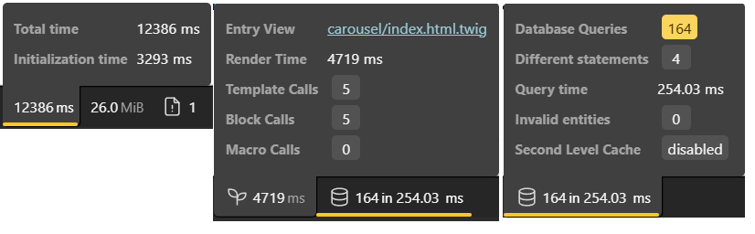
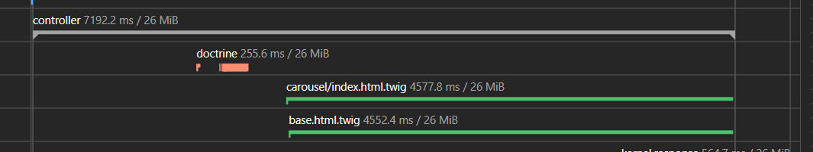

# Analyse des performances web <!-- omit in toc -->

## Sommaire <!-- omit in toc -->

- [Introduction](#introduction)
- [Hypothèses](#hypothèses)
- [Tests et mesures](#tests-et-mesures)
- [Solutions](#solutions)

## Introduction

La performance est un aspect non négligeable du développement web,
car cela influence directement l'expérience utilisateur.


Un site ou une application lente risque de faire fuir les utilisateurs,
augmenter le taux de rebond et réduire les conversions,
ce qui fera indéniablement chuter le référencement.
De plus, avec l’essor des appareils mobiles et des connexions réseau rapide,
les utilisateurs sont de plus en plus exigeants en matière de vitesse,
il est donc nécessaire d’optimiser le code pour obtenir une exécution rapide et efficace.

En PHP, une mauvaise gestion des ressources,
des requêtes inefficaces ou un code mal optimisé risquent de ralentir une application.
Optimiser son code permet améliorer la vitesse d'exécution,
mais aussi réduire la consommation de ressources serveurs,
ce qui peut avoir un impact direct sur les coûts d’hébergement.

## Hypothèses

Au premier chargement de la page, on peut voir que le temps de chargement est très long. On suppose une mauvaise gestion des controllers/templates, qui ralenti fortement le temps de réponse du serveur. 

Une fois la page chargée, on voit que les images chargent très lentement, une par une. On peut déjà supposer une mauvaise gestion des ressources, et une mauvaise optimisation des images qui ralenti le chargement de la page. De plus, l'affichage des images une à une, suggère que les images sont chargées une par une, ce qui nous permet de supposer que les images sont chargées en plusieurs requêtes, et non pas en une seule. De plus, la page utilise des images au format png, qui est un format lourd et peu optimisé pour le web. 

Pour tout ce qui concerne le css, puisque tailwind est utilisé, il ne devrait pas y avoir de problèmes de performance, comme tailwind est optimisé pour le web. Pour le js, le site ne semble pas utiliser de js, sur cette page donc il ne devrait pas y avoir de problèmes de performance.
## Tests et mesures

- [Front avec lighthouse](#front-avec-lighthouse)
- [Back avec les outils symfony (debug toolbar + profiler)](#back-avec-outils-symfony)

### Front avec lighthouse
Lors de la tentative de génération de rapport lighthouse, lighthouse génère une erreur de timeout qui montre à quel point le site pose problème en termes de chargement.

```bash
Network.enable timed out. Increase the 'protocolTimeout' setting in launch/connect calls for a higher timeout if needed.
Channel: DevTools
Initial URL: http://127.0.0.1:8888/carousel
Chrome Version: 136.0.0.0
Stack Trace: bt
at <instance_members_initializer> (devtools://devtools/bundled/third_party/puppeteer/puppeteer.js:111:830)
at new Ar (devtools://devtools/bundled/third_party/puppeteer/puppeteer.js:111:872)
at qr.create (devtools://devtools/bundled/third_party/puppeteer/puppeteer.js:111:56)
at s._rawSend (devtools://devtools/bundled/third_party/puppeteer/puppeteer.js:121:773)
at Nr.send (devtools://devtools/bundled/third_party/puppeteer/puppeteer.js:116:561)
at $n.addClient (devtools://devtools/bundled/third_party/puppeteer/puppeteer.js:318:657)
at Hn.initialize (devtools://devtools/bundled/third_party/puppeteer/puppeteer.js:323:2161)
at #Hn (devtools://devtools/bundled/third_party/puppeteer/puppeteer.js:353:4754)
at cs._create (devtools://devtools/bundled/third_party/puppeteer/puppeteer.js:353:1450)
at devtools://devtools/bundled/third_party/puppeteer/puppeteer.js:363:2545
```

### Back avec outils Symfony
Sur la toolbar de debug, on peut voir un temps d'initialisation de la page de plus de 3 secondes, et un temps total de plus de 12 secondes. 
On peut aussi noter que le rendu twig a pris presque 5 secondes, mais surtout que la page à elle seule, a effectué 164 queries à la database, ce qui est énorme.
Ces requêtes sont principalement dues à la récupération des images, qui sont cherchées puis chargées une par une, ce qui est très long pour le serveur.



Le profiler nous confirme ces faits tout en donnant plus de précisions. Ici, on peut voir la timeline de la génération de la page, on constate que c'est long à cause du controller, qui empêche les templates de charger rapidement.



On note aussi dans les logs une dépréciation, qui nous suggère d'utiliser l'extension php "intl" pour de meilleures performances.

## Solutions

Dans un premier temps, il faut optimiser le code PHP, en évitant de faire trop de requêtes à la base de données. C'est ce qui prend le plus de temps et qui empêche la page de s'afficher, avant même de charger les images.
On va donc modifier la gestion du carousel dans le controller, ce qui nécessite une requête sql spécifique. On va alors corriger les relations entre les entités, pour récupérer les images en un seul appel, et non pas en plusieurs. On va aussi utiliser une requête sql pour récupérer les images, ce qui va nous permettre de charger la page plus rapidement.
Les relations entre les entités Modeles, ModelesFiles, Galaxy et DirectusFiles ont enfin été corrigées, ce qui permet d'avoir des collections pour gérer efficacement les données. 
Une fois la migration faite avec les commandes suivantes, on passe à la modification du controller.
```bash
docker compose exec optimization-php php bin/console make:migration
docker compose exec optimization-php php bin/console doctrine:migrations:migrate
```

Ensuite, on crée une requête sql pour récupérer les images de chaque galaxy, en une seule fois, ce qui nous permet de passer de 164 à 22 requêtes sql.
Cette fonction dans ModelesRepository.php permet de diminuer considérablement le nombre de requêtes sql.
```php
public function findWithFilesById($id)
	{
		return $this->createQueryBuilder('m')
				->leftJoin('m.modelesFiles', 'mf')
				->addSelect('mf')
				->leftJoin('mf.directusFiles', 'df')
				->addSelect('df')
				->where('m.id = :id')
				->setParameter('id', $id)
				->getQuery()
				->getOneOrNullResult();
	}
```

Cependant le problème de performance persiste, et le controller prend toujours une durée excessive à charger la page. Le temps restant ne me permet pas de faire de nouveaux tests, je ne peux donc que rajouter des suppositions.
- Problème lié à symfony / doctrine
- Problème lié à la base de données
- Problème lié à la taille des images

Ensuite, il faudra dans le futur veiller à bien convertir les images en png/jpg vers le format webp, qui est bien plus adapté pour le web. Cela permettra aux images de charger bien plus rapidement et elles seront par ailleurs, moins lourdes ce qui allègera le serveur. Il faut aussi réduire la taille des images qui demandent trop de ressources.
